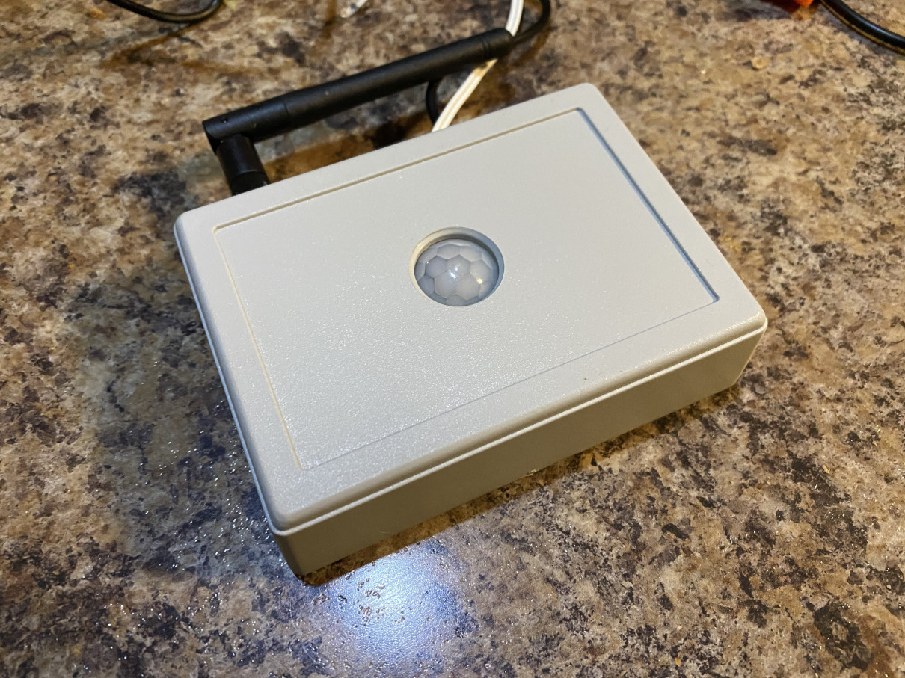
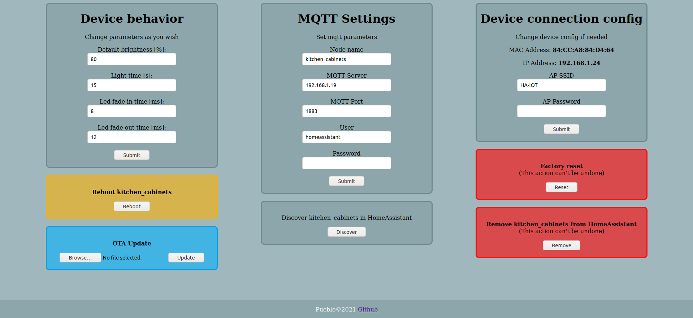
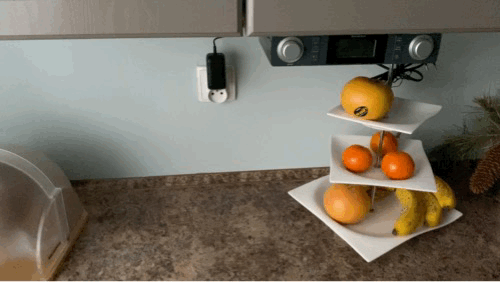
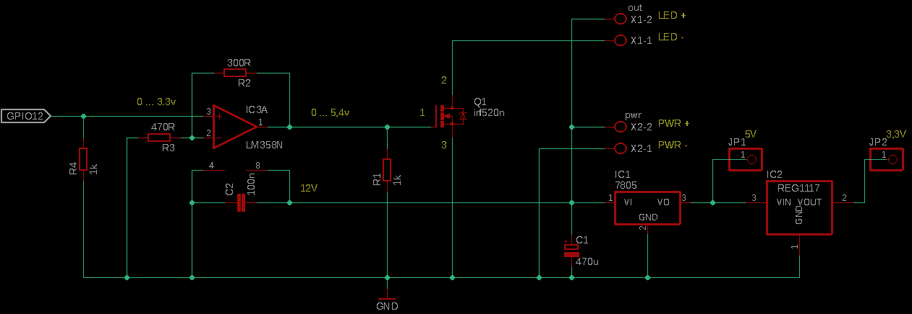
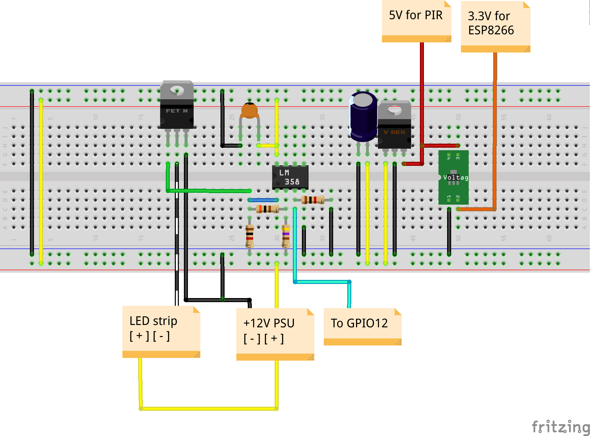
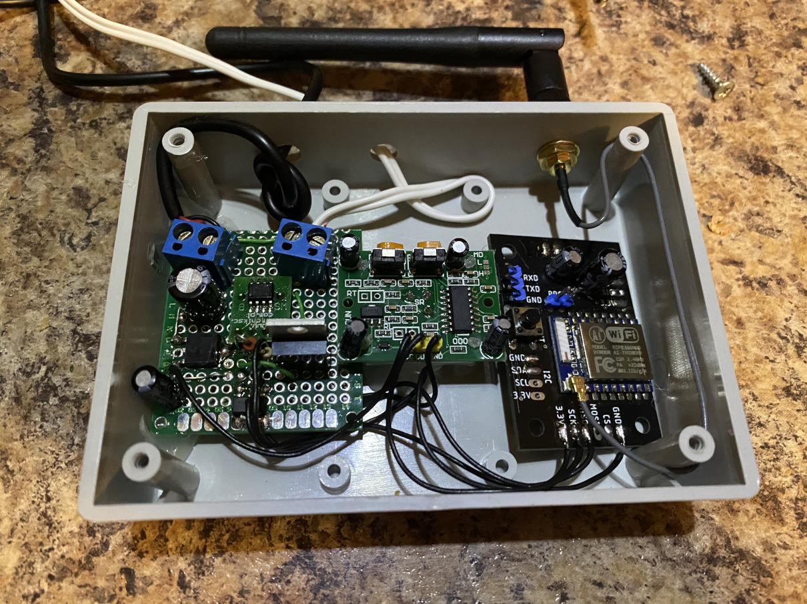
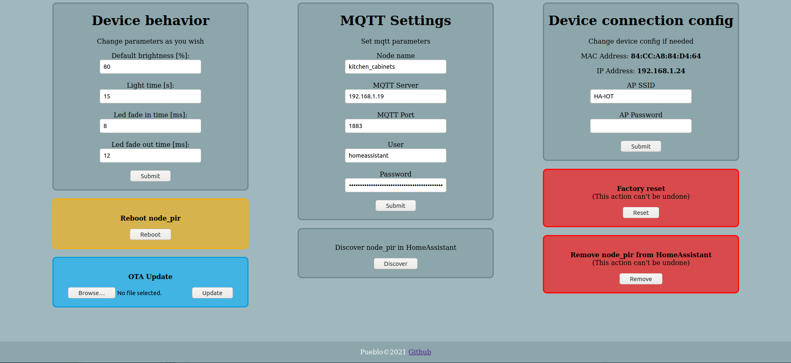
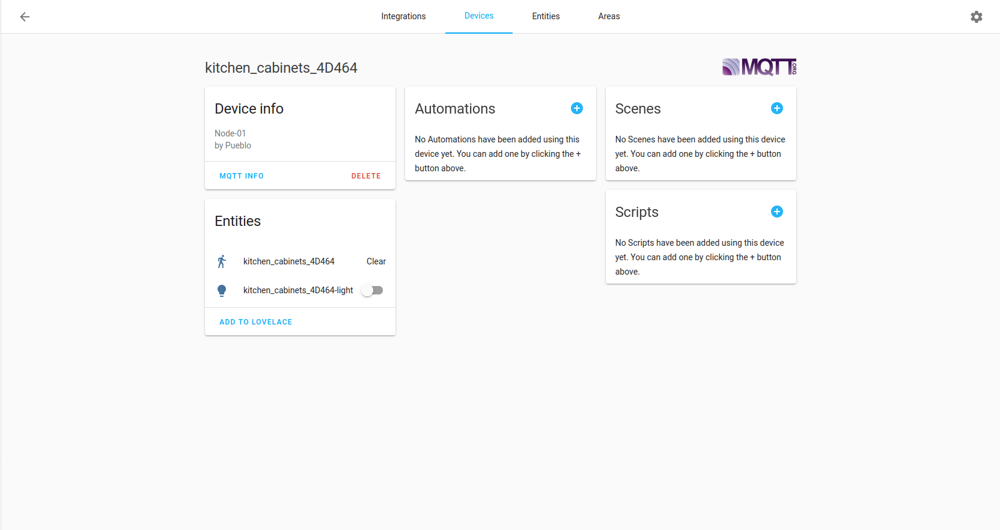

***ESP8266 PWM Led strip controller with motion sensor***

Features:

1. User friendly controller Web UI
	 - Configuring controller behavior
		 - Base brightness
		 - How long, led strip will be turned on
		 - Smooth state change, when Led strip is turning on (Fade in)
		 - Smooth state change, when Led strip is turning off (Fade out)
	 - Configuring MQTT connection parameters
	 - Configuring Access Point parameters
	 - Rebooting controller 
2. Supports Home Assistant MQTT integration
	 - Exposes binary sensor for motion sensing
	 - Exposes light entity for switching and brightness control
	 - Discovery by Home Assistant from Web UI level
	 - Removing device from Home Assistant from Web UI level
	 - Not blocking, automatic reconnect to MQTT broker, after loosing connection (after 5 minutes by default)
3. Works standalone without Home Assistant
4. OTA Updates from Web UI level
5. Contorller AP mode for basic setup and failsafe scenario - when Wi-Fi AP not available or Wi-Fi AP credentials are invalid, controller gives option to fix config
	- Controller have possibility to configure 2 Wi-Fi AP's - when 1. AP is not available, then controller connetects to 2. AP
	- WebUI button for reconnect to Wi-Fi AP
	- Not blocking, automatic reconnect to Wi-Fi AP, after loosing connection (after 10 minutes by default)

TODOs:
 1. [x] ~~Reconnect when Wi-Fi network is back + Add option 'Reconnect' to WebUI~~
 2. [x] ~~Add possibility to connect to second AP~~
 3. [ ] Home Assistant - broadcast controller status after rebooting Home Assistant
 4. [ ] Broadcast controller status after boot
 5. [X] ~~Refactoring main.cpp - splitting to smaller / more readable/ maintainable chunks~~
 6. [ ] Add controllers logging to Web UI

**If you like this project, give it a _star_, or fork it and contribute!**

Prerequisites:
- ESP8266 with atleast 1MB flash - Wemos D1 Lite / NodeMCU 1.0 / Bare ESP07 module
  - consider module with external antenna, if Wi-Fi signal is weak in desired controller location
- 12V Power Supply (Amps depending on used led strip)
- PIR HC-SR501 (AM312 should also work but not tested)
- 1x N-Mosfet IRLZ44N (IRF520N will also work)
- 1x 7805 / 78M05 - 5V voltage regulator
- 1x 1117-3.3 - 3.3V volatage regulator
- 1x LM358 - OP-Amp
- Universal PCB (perfboard)
- 2x 1k ohm resistor 
- 1x 470 ohm resistor
- 1x 300 ohm resistor 
- 1x 100nF ceramic capacitor
- 1x 470uF electrolytic capacitor 
- Little bit of soldering skills :)

	Optional:
	- 2x 2pole screw terminal for connecting power and LED strip (easier to disconnect in the future)
		
		
*Controller schematic:*

1. Solder everything like shown on schematic. Capacitor C2 should be as close to LM358 as possible.
	- Before connecting everything, check if there is no shorts on PCB using i.e. multimeter:
		- check between PWR+ and PWR- pins.
		- check between 5V output and ground and 3.3V output and ground.
	- Power up board (without ESP8266, PIR):
		- check output voltage at 5V regulator. Should be 5V
		- check output voltage at 3.3V regulator. Should be 3.3V
2. Connect no 3. pin of LM358 to GPIO12 of the ESP8266
3. Connect PIR signal to GPIO14 of the ESP8266
4. Connect JP1 - 5V output (3. pin of 7805) - to PIR power pin
5. Connect JP2 - 3.3V output (2. pin of 1117-3.3) - to ESP8266 power pin
6. Connect GNDs together - from the ESP8266 board, PIR, and controlling board

*Flashing firmware:*
1. Clone this repo to PlatformIO and flash it to ESP8266 board
2. Get binary from Releases and flash it using esptool:
 - `esptool.py --port <COM no> write_flash -fs 1MB -fm dout 0x0 <firmware_location>/firmware.bin`

*Basic setup:*
1. Until controller is not connected to Wi-Fi network, controller will be working in AP Mode
2. Search for network "NODE". Connect to it, using password: "12345678"
3. Open browser and type address: 192.168.1.1
4. Controller Web UI should load. In "Device connection settings" fill SSID and password of your Wi-Fi network and click 'Submit'. Page should reload
5. After reload click 'Reboot' button. Controller should now try to connect to given Wi-Fi network. Check in your router settings, what controllers IP address is.
   - You may also check assigned IP address in Serial ouptut
   - It may take a while for router to refresh. You also may check if network "NODE" is still available. If yes, then this means, that network were not found or wrong Wi-Fi credentials were given.
6. Congratulations, controller is ready to work :) 

*MQTT setup and Home Assistant integration*
1. Fill MQTT connection data, after submiting data, controller will automatically reboot and try to connect to MQTT Broker
   - You may check if controller is connected to broker in Serial output
2. After reboot click 'Discover' button. Controller should appear on devices list in MQTT integration.
3. To remove controller from Home Assistant MQTT intergration, click 'Remove' button

